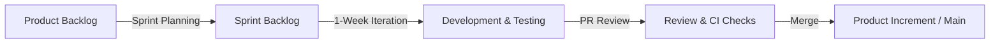

# Software Development Lifecycle (SDLC) & Internship Reflection

This document summarizes the SDLC frameworks and agile processes observed during Week 1 of the internship, focusing on how they shape code releases.

## 1. Selected SDLC Model: Iterative & Agile (Scrum)
For this project, we employ an **Agile Scrum** methodology:
- **Product Backlog**: Contains user stories like "As a lead developer, I want a commit frequency leaderboard so I can identify team velocity."
- **Sprints**: 1-week cycles matching the internship weekly timelines.
- **Sprint Backlog**: The list of tasks (DSA modules, SQL setups, System Design diagrams) planned for the week.
- **Daily Standup**: Mock meetings tracking progress, blockers, and alignment.

---

## 2. Weekly Reflections (Week 1 Learning Journal)

### Key Milestones Achieved
- **Git Best Practices**: Switched from direct commits on `main` to a structured feature branch workflow. Resolving merge conflicts helped clarify Git's tree management model.
- **Complexity Focus**: Analyzing Python dictionaries vs nested list searches showed the runtime benefit of average $O(1)$ lookups.
- **Relational Constraints**: Added database foreign keys and transaction logs to enforce referential integrity.

### Challenges Overcome
- **Nested Repositories**: Realizing `DevInsight-Lab` had its own git config nested in the parent project helped isolate target branches correctly.
- **CI Pipelines**: Configured GitHub Actions linting to check file structure compliance.
