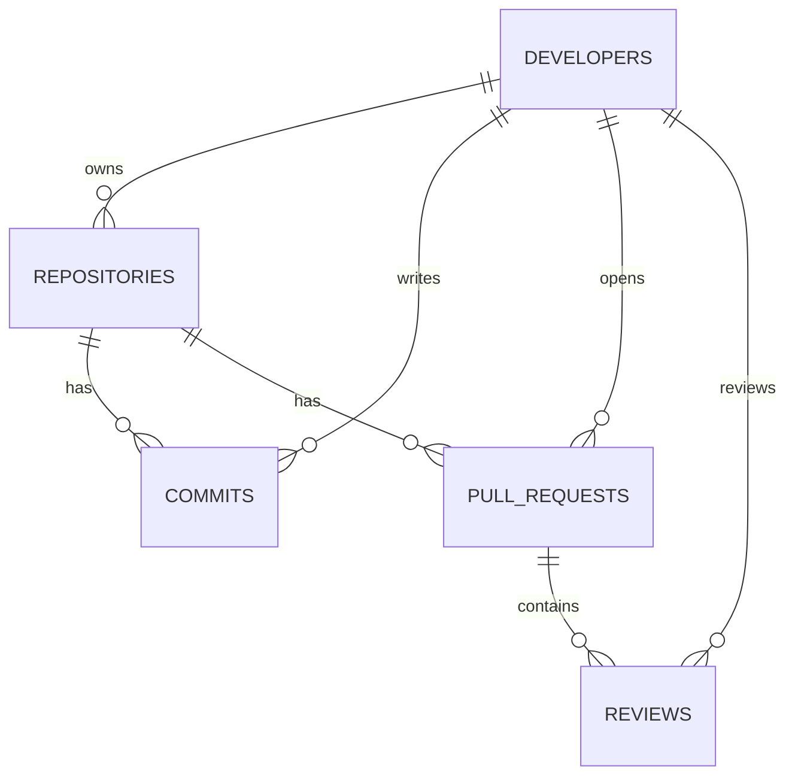

# SQL Schema & Query Documentation

This document describes the SQL data models, relationships, and queries used to capture developer productivity in `DevInsight-Lab`.

## 1. Relational Database Schema

The analytics portal uses PostgreSQL to track repository assets:

- **developers**: Contains personal identifier metrics (`id`, `username`, `email`, `role`).
- **repositories**: Stores project locations (`id`, `name`, `owner_id`, `created_at`).
- **commits**: Stores commit identifiers (`id`, `sha`, `author_id`, `repo_id`, `message`, `committed_at`).
- **pull_requests**: Maps code additions (`id`, `title`, `author_id`, `repo_id`, `status` [open/closed/merged]).
- **reviews**: Maps feedback records (`id`, `pr_id`, `reviewer_id`, `state` [approved/changes_requested], `submitted_at`).



---

## 2. Advanced Queries and Analytics

### Pull Request Approval Transaction Workflow
When a Pull Request is approved:
1. Validate reviews are positive.
2. Update PR state to 'merged'.
3. Append commits to the repository log.

These updates execute inside a transaction block to maintain database integrity:
```sql
BEGIN;
UPDATE pull_requests SET status = 'merged' WHERE id = 12;
INSERT INTO commits (sha, author_id, repo_id, message)
VALUES ('abc123d4', 2, 1, 'Merge pull request #12 from feature/sql');
COMMIT;
```

### Leaderboard Analytics Query
Generates a list of developers who have authored more than 5 merged pull requests:
```sql
SELECT d.username, COUNT(pr.id) as merge_count
FROM developers d
JOIN pull_requests pr ON d.id = pr.author_id
WHERE pr.status = 'merged'
GROUP BY d.username
HAVING COUNT(pr.id) > 5
ORDER BY merge_count DESC;
```

---

## 3. Database Indexes for Performance
To speed up leaderboard counts, indexes are added on foreign key lookup targets:
- `idx_commits_author_id`
- `idx_pull_requests_status`
