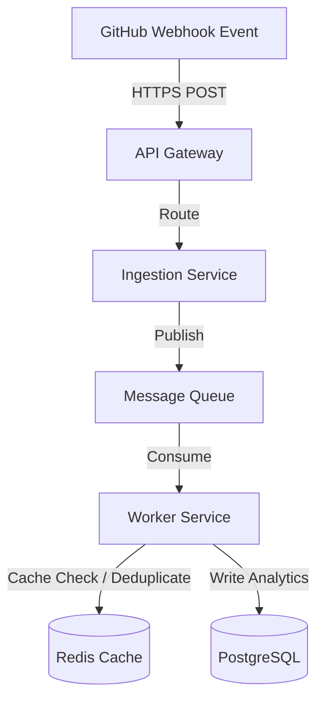

# System Design - Scalable Developer Activity Analytics

This document presents the system design details for the `DevInsight-Lab` analytics engine, designed to support thousands of active developers.

## 1. Webhook Ingestion Architecture
To aggregate developer activities (commits, PRs, reviews) in real-time, the portal uses webhooks:
- GitHub triggers HTTP POST requests to the ingestion service when events occur.
- An **API Gateway** validates payload headers, checks rate limits, and routes the events.
- **Webhook Ingestion Service** publishes raw events to a message broker (e.g. Apache Kafka or RabbitMQ) immediately, returning a `202 Accepted` status to minimize latency.

---

## 2. Event Processing Pipeline
- **Queue Workers**: Consume messages asynchronously from the message broker to process events.
- **Deduplication**: Uses Redis to store event SHAs and prevent processing duplicate webhooks.
- **Relational Storage**: Commits, PRs, and review details are stored in the PostgreSQL database.

---

## 3. Scalability & Availability Strategies
- **Database Replication**: Uses a Single-Primary, Multi-Replica configuration. Writes target the Primary node, while dashboard queries fetch data from Read Replicas.
- **Caching**: Dashboard metrics (e.g. contributor leaderboards) are cached in Redis with a 5-minute TTL to reduce CPU load on database instances.
- **Observability**: Prometheus collects service performance metrics, while Grafana displays dashboard latency, queue size, and error rates.
